# Different Etas experiment

## Detailed experiment description(how to run, how to reproduce)

Goal of experiment is to reproduce conforem tree simulations stored in folder: [`target_images`](./target_images).

For each conforem image corresponds intial JSON file `init_model_val_eta*.json`.

+ bif = 2.5
+ and boundary conditions which corresponds to __Laplace type__

Command used to run simulations:

```bash
../riversim -n 10000 --maximal-river-height=4 -V --save-each-step -o eta02 init_model_val_eta02.json
```

### Target Images

eta = 0.2 | eta = 0.5 | eta = 1 | eta = 2 | eta = 3
:--------:|:---------:|:-------:|:-------:|:-------:
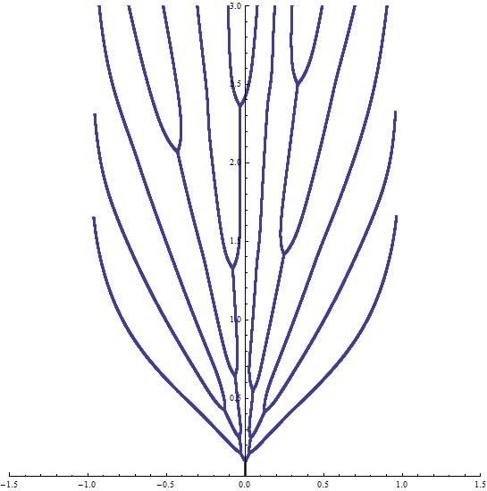  |  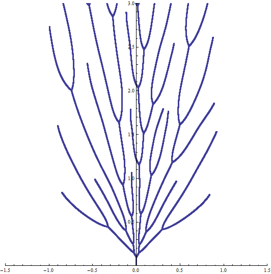 | 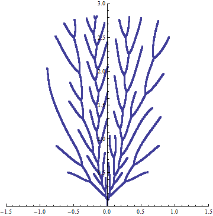 |  | 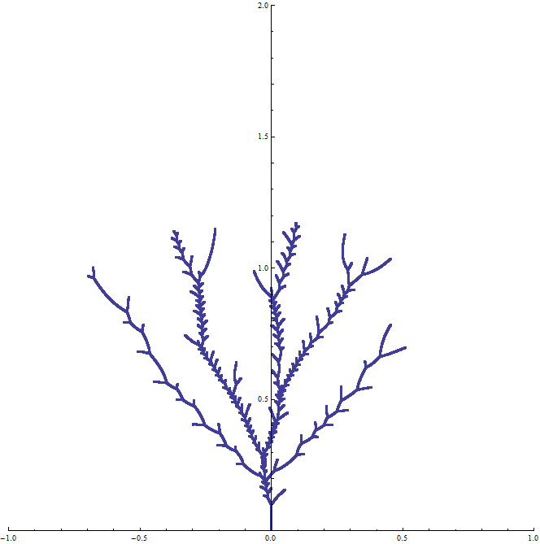 


## Simulation results

### Version RiverSIM 2.6.1

eta = 0.2 | eta = 0.5 | eta = 1 | eta = 2 | eta = 3
:--------:|:---------:|:-------:|:-------:|:-------:
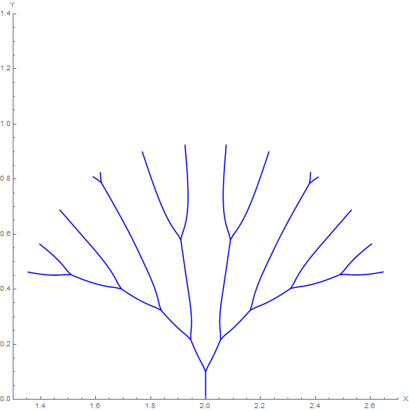  |  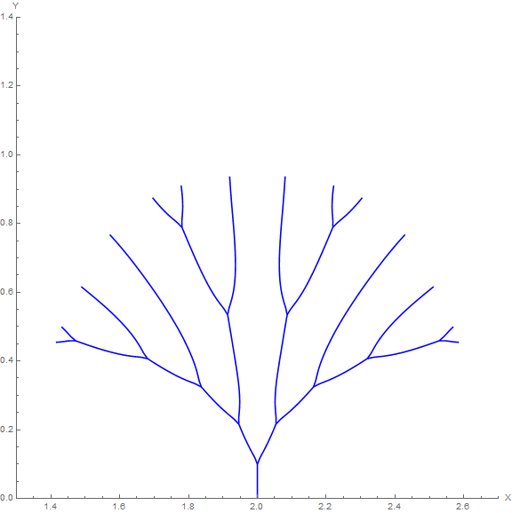 | 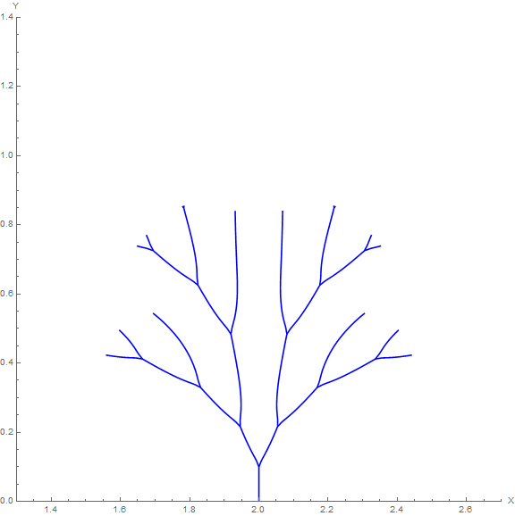 | 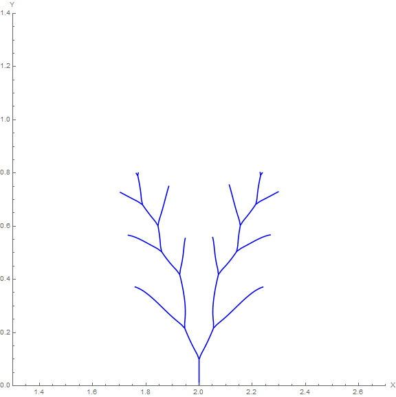 | 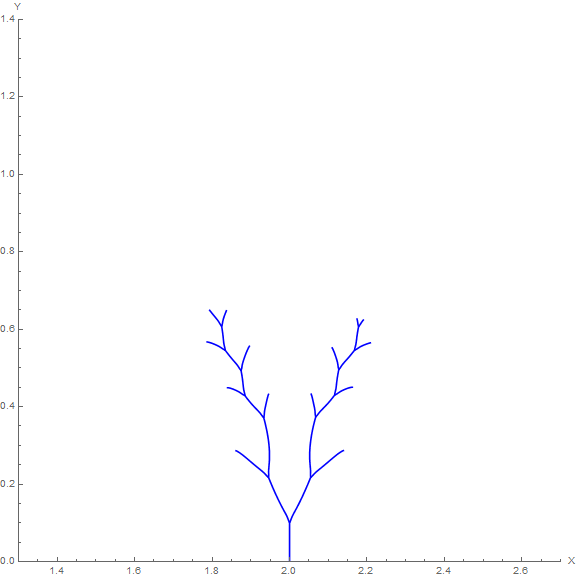 
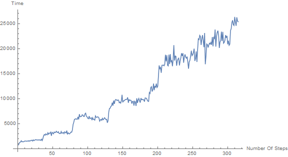  |   | 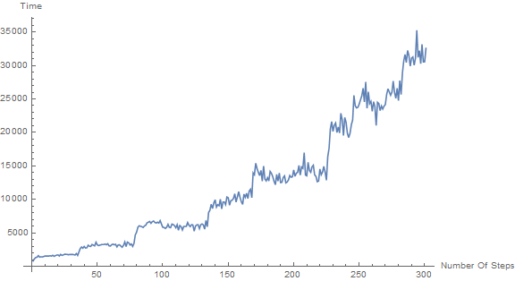 | 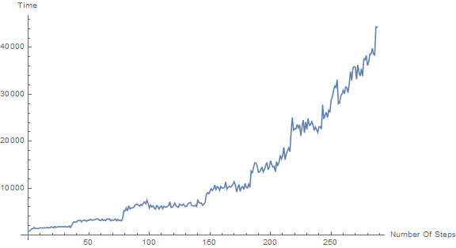 | 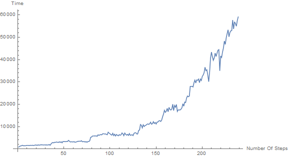 
|[init_model_val_eta02.json](init_model_val_eta02.json)|[init_model_val_eta05.json](init_model_val_eta05.json)|[init_model_val_eta1.json](init_model_val_eta1.json)|[init_model_val_eta2.json](init_model_val_eta2.json)|[init_model_val_eta3.json](init_model_val_eta3.json)|

## Conclusions

__Results are very different.__